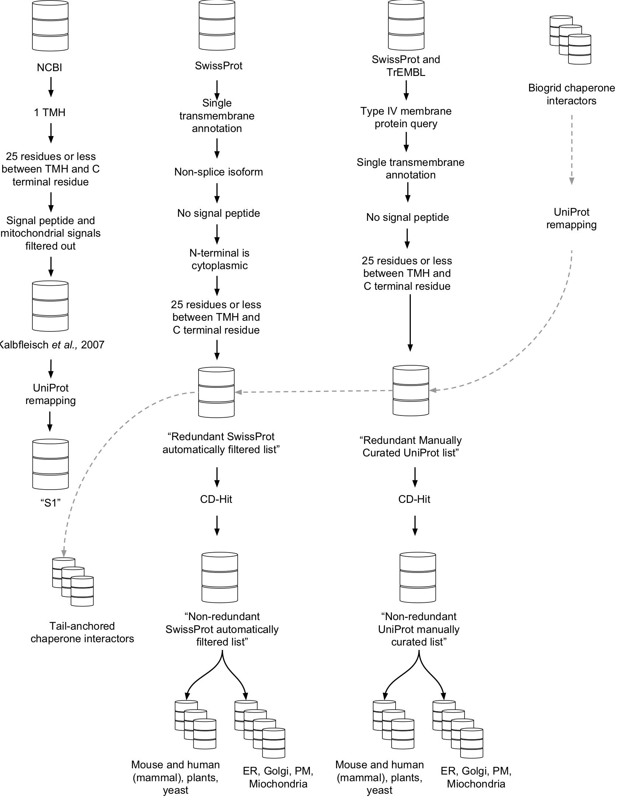

#Tail Anchor Prediction

##Introduction

This bundle of scripts aims to filter a uniprot text file into a list of potential Tail Anchors. Basically the list filters a uniprot text file to a list of uniprot IDs that are likely tail anchors.

##Running the Prediction

Save your uniprot text downloaded dataset in the folder containing the scripts.

Then:

 - Open a terminal
 - Navigate to the folder containing the scripts. (*`cd Downloads/TAPredict` for example*.)
 - Type `bash runme.sh` and hit enter.
 - The script will prompt you to enter the name of your input file.
 - The results will be saved in a folder with the current time and date.

 It is important that you do not add files to the folder, or tamper with input files, or script files whilst the script is running as the script may not report an error and blunder on recklessly with erroneous I/O files.

##Filter Method

There are a series of filters to deduce tail anchored proteins.

1. The script filters proteins by those with `TRANSMEM` regions. `TRANSMEM` annotation includes experimentally confirmed TMDs and predicted TMDs. Predictions of TMDs are according to a consensus of TMHMM, Memsat, Phobius and the hydrophobic moment plot method of Eisenberg and coworkers and is calculated by uniprot itself.
2. The TMDs of each protein are counted. If a protein has more than 1 `TRANSMEM` region, it is not added to the list. The list now contains those protein IDs with only a single `TRANSMEM` region.
3. The script counts the distance between the `TRANSMEM` region and the C terminus. If the final residue of the `TRANSMEM` annotated region is within 15 residues of the C terminal residue, the ID is added to the list.
4. Finally the script removes any proteins that contain `NON_TER` annotation. This removes potential signal anchor protein and multipass protein splice isoforms from the list.

This final list, and any intermediate list, can be directly uploaded for batch retrieval from [***uniprot***](http://www.uniprot.org/uploadlists) for more information.

##System Requirements

This script requires python 2.7, biopython, and an active internet connection.

####Installing Biopython:

 In **OSX** or **Linux**:

 - Open a terminal.
 - Run the following commands, entering your password where necessary:

 	`sudo easy_install pip`

 	`sudo pip install numpy`

	`sudo pip install Biopython`

##Reporting errors

If you run into any problems or have any suggestions and corrections, please, [log an issue on
GitHub](https://github.com/jbkr/TApredict/issues/new).

**Common problems.**

If you come across any errors during the installation it is probably because python is not installed in the default locations (and you probably know how to fix it), or the package has already been installed before you did these commands. Type in the above commands one after the other regardless and then try running the script.

If errors come up during running the script, it is probably because network connection has dropped, or files have been moved or added prematurely.
